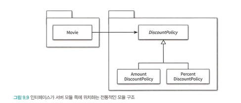
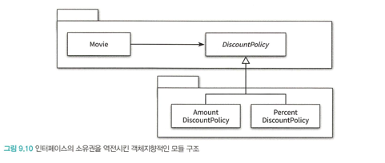

## 유연한 설계
### 개방-폐쇄 원칙
* 소프트웨어 개체(클래스, 모듈, 함수 등등)는 확장에 대해 열려 있어야 하고, 수정에 대해서는 닫혀 있어야 한다
  * 여기서 키워드는 '확장'과 '수정'이다. 이 둘은 순서대로 애플리케이션의 '동작'과 '코드'의 관점을 반영한다
    * 확장에 대해 열려 있다: 애플리케이션의 요구사항이 변경될 때 이 변경에 맞게 새로운 '동작'을 추가해서 애플리케이션의 기능을 확장할 수 있다.
    * 수정에 대해 닫혀 있다: 기존의 '코드'를 수정하지 않고도 애플리케이션의 동작을 추가하거나 변경할 수 있다
* 컴파일타임 의존성을 고정시키고 런타임 의존성을 변경하라
  * 사실 개방-폐쇄 원칙은 런타임 의존성과 컴파일타임 의존성에 관한 이야기다.
  * 런타임 의존성은 실행 시에 협력에 참여하는 객체들 사이의 관계다.
  * 컴파일타임 의존성은 코드에서 드러나는 클래스들 사이의 관계다.
  * 그리고 앞장에서 살펴본 것처럼 유연하고 재사용 가능한 설계에서 런타임 의존성과 컴파일타임 의존성은 서로 다른 구조를 가진다.
  * 개방-폐쇄 원칙을 수용하는 코드는 컴파일타임 의존성을 수정하지 않고도 런타임 의존성을 쉽게 변경할 수 있다.
  * 의존성 관점에서 개방-폐쇄 원칙을 따르는 설계란 컴파일타임 의존성은 유지하면서 런타임 의존성의 가능성을 확장하고 수정할 수 있는 구조라고 할 수 있다.
* 추상화가 핵심이다
  * 개방-폐쇄 원칙의 핵심은 추상화에 의존하는 것이다. 여기서 '추상화'와 '의존'이라는 두 개념 모두가 중요하다.
  * 추상화란 핵심적인 부분만 남기고 불필요한 부분은 생략함으로써 복잡성을 극복하는 기법이다. 추상화 과정을 거치면 문맥이 바뀌더라도 변하지 않는 부분만 남게 되고 문맥에 따라 변하는 부분은 생략된다. 추상화를 사용하면 생략된 부분을 문맥에 적합한 내용으로 채워넣음으로써 각 문맥에 적합하게 기능을 구체화하고 확장할 수 있다.
  * 개방-폐쇄 원칙의 관점에서 생략되지 않고 남겨지는 부분은 다양한 상황에서의 공통점을 반영한 추상화의 결과물이다. 공통적인 부분은 문맥이 바뀌더라도 변하지 않아야 한다. 다시 말해서 수정할 필요가 없어야 한다. 따라서 추상화 부분은 수정에 대해 닫혀 있다. 추상화를 통해 생략된 부분은 확장의 여지를 남긴다. 이것이 추상화가 개방-폐쇄 원칙을 가능하게 만드는 이유다.
  * 올바른 추상화를 설계하고 추상화에 대해서만 의존하도록 관계를 제한함으로써 설계를 유연하게 확장할 수 있다.
  * 여기서 주의할 점은 추상화를 했다고 해서 모든 수정에 대해 설계가 폐쇄되는 것은 아니라는 것이다. 수정에 대해 닫혀 있고 확장에 대해 열려 있는 설계는 공짜로 얻어지지 않는다. 변경에 의한 파급효과를 최대한 피하기 위해서는 변하는 것과 변하지 않는 것이 무엇인지를 이해하고 이를 추상화의 목적으로 삼아야만 한다. 추상화가 수정에 대해 닫혀 있을 수 있는 이유는 변경되지 않을 부분을 신중하게 결정하고 올바른 추상화를 주의 깊게 선택했기 때문이라는 사실을 기억하라.

### 생성 사용 분리
* 결합도가 높아질수록 개방-폐쇄 원칙을 따르는 구조를 설계하기가 어려워진다. 알아야 하는 지식이 많으면 결합도도 높아진다. 특히 객체 생성에 대한 지식은 과도한 결합도를 초래하는 경향이 있다. 객체의 타입과 생성자에 전달해야 하는 인자에 대한 과도한 지식은 코드를 특정한 컨텍스트에 강하게 결합시킨다. 컨텍스트를 바꾸기 위한 유일한 방법은 코드 안에 명시돼 있는 컨텍스트에 대한 정보를 직접 수정하는 것뿐이다.
* 물론 객체 생성을 피할 수는 없다. 어딘가에서는 반드시 객체를 생성해야 한다. 문제는 객체 생성이 아니다. 부적절한 곳에서 객체를 생성한다는 것이 문제다.
* 메시지를 전송하지 않고 객체를 생성하기만 한다면 아무런 문제가 없었을 것이다. 또는 객체를 생성하지 않고 메시지를 전송하기만 했다면 괜찮았을 것이다. 동일한 클래스 안에서 객체 생성과 사용이라는 두 가지 이질적인 목적을 가진 코드가 공존하는 것이 문제인 것이다.
* 유연하고 재사용 가능한 설계를 원한다면 객체와 관련된 두 가지 책임을 서로 다른 객체로 분리해야 한다. 하나는 객체를 생성하는 것이고, 다른 하나는 객체를 사용하는 것이다. 한마디로 말해서 객체에 대한 생성과 사용을 분리(separation use from creation)해야 한다.
* 사용으로부터 생성을 분리하는 데 사용되는 가장 보편적인 방법은 객체를 생성할 책임을 클라이언트로 옮기는 것이다.
* 현재의 컨텍스트에 관한 결정권을 가지고 있는 클라이언트로 컨텍스트에 대한 지식을 옮김으로써 Movie는 특정한 클라이언트에 결합되지 않고 독립적일 수 있다.
* FACTORY 추가하기
  * 객체 생성과 관련된 지식이 Client와 협력하는 클라이언트에게까지 새어나가기를 원하지 않는다고 가정해보자.
  * 이 경우 객체 생성과 관련된 책임만 전담하는 별도의 객체를 추가하고 Client는 이 객체를 사용하도록 만들 수 있다. 이처럼 생성과 사용을 분리하기 위해 객체 생성에 특화된 객체를 FACTORY라고 부른다
* 순수한 가공물에게 책임 할당하기
  * 책임 할당의 가장 기본이 되는 원칙은 책임을 수행하는 데 필요한 정보를 가장 많이 알고 있는 INFORMATION EXPERT에게 책임을 할당하는 것이다. 도메인 모델은 INFORMATION EXPERT를 찾기 위해 참조할 수 있는 일차적인 재료다. 어떤 책임을 할당하고 싶다면 제일 먼저 도메인 모델 안의 개념 중에서 적절한 후보가 존재하는지 찾아봐야 한다.
  * FACTORY를 추가한 이유는 순수하게 기술적인 결정이다. 전체적으로 결합도를 낮추고 재사용성을 높이기 위해 도메인 개념에게 할당돼 있던 객체 생성 책임을 도메인 개념과는 아무런 상관이 없는 가공의 객체로 이동시킨 것이다.
  * 크레이그 라만은 시스템을 객체로 분해하는 데는 크게 두 가지 방식이 존재한다고 설명한다. 하나는 표현적 분해(representational decomposition)이고 다른 하나는 행위적 분해(behavioral decomposition)다.
    * 표현적 분해는 도메인에 존재하는 사물 또는 개념을 표현하는 객체들을 이용해 시스템을 분해하는 것이다.
    * 표현적 분해는 도메인 모델에 담겨 있는 개념과 관계를 따르며 도메인과 소프트웨어 사이의 표현적 차이를 최소화하는 것을 목적으로 한다. 따라서 표현적 분해는 객체지향 설계를 위한 가장 기본적인 접근법이다.
  * 종종 도메인 개념을 표현하는 객체에게 책임을 할당하는 것만으로는 부족한 경우가 발생한다. 도메인 모델은 설계를 위한 중요한 출발점이지만 단지 출발점이라는 사실을 명심해야 한다. 실제로 동작하는 애플리케이션은 데이터베이스 접근을 위한 객체와 같이 도메인 개념들을 초월하는 기계적인 개념들을 필요로 할 수 있다.
  * 모든 책임을 도메인 객체에게 할당하면 낮은 응집도, 높은 결합도, 재사용성 저하와 같은 심각한 문제점에 봉착하게 될 가능성이 높아진다. 이 경우 도메인 개념을 표현한 객체가 아닌 설계자가 편의를 위해 임의로 만들어낸 가공의 객체에게 책임을 할당해서 문제를 해결해야 한다. 크레이그 라만은 이처럼 책임을 할당하기 위해 창조되는 도메인과 무관한 인공적인 객체를 PURE FABRICATION(순수한 가공물)이라고 부른다.
  * 어떤 행동을 추가하려고 하는데 이 행동을 책임질 마땅한 도메인 개념이 존재하지 않는다면 PURE FABRICATION을 추가하고 이 객체에게 책임을 할당하라.
    * 그 결과로 추가된 PURE FABRICATION은 보통 특정한 행동을 표현하는 것이 일반적이다.
    * 따라서 PURE FABRICATION은 표현적 분해보다는 행위적 분해에 의해 생성되는 것이 일반적이다.
  * 이런 측면에서 객체지향이 실세계의 모방이라는 말은 옳지 않다
  * 객체지향 애플리케이션은 도메인 개념뿐만 아니라 설계자들이 임의적으로 창조한 인공적인 추상화들을 포함하고 있다.
  * 애플리케이션 내에서 인공적으로 창조한 객체들이 도메인 개념을 반영하는 객체들보다 오히려 더 많은 비중을 차지하는 것이 일반적이다.
  * 객체지향 애플리케이션의 대부분은 실제 도메인에서 발견할 수 없는 순수한 인공물로 가득 차 있다.
  * 설계자로서의 우리의 역할은 도메인 추상화를 기반으로 애플리케이션 로직을 설계하는 동시에 품질의 측면에서 균형을 맞추는 데 필요한 객체들을 창조하는 것이다.
  * 레베카 워프스브록의 말을 빌리자면 "애플리케이션 모델은 사용자에게 반응하고, 실행을 제어하며, 외부 리소스에 연결하는 컴퓨터 객체를 이용해 도메인 모델을 보충한다".
  * 도메인 개념을 표현하는 객체와 순수하게 창조된 가공의 객체들이 모여 자신의 역할과 책임을 다하고 조화롭게 협력하는 애플리케이션을 설계하는 것이 목표여야 한다.
  * 먼저 도메인의 본질적인 개념을 표현하는 추상화를 이용해 애플리케이션을 구축하기 시작하라. 만약 도메인 개념이 만족스럽지 못하다면 주저하지 말고 인공적인 객체를 창조하라.
  * 객체지향이 실세계를 모방해야 한다는 헛된 주장에 현혹될 필요가 없다.
  * 우리가 애플리케이션을 구축하는 것은 사용자들이 원하는 기능을 제공하기 위해서지 실세계를 모방하거나 시뮬레이션하기 위한 것이 아니다.
  * 도메인을 반영하는 애플리케이션의 구조라는 제약 안에서 실용적인 창조성을 발휘할 수 있는 능력은 훌륭한 설계자가 갖춰야 할 기본적인 자질이다.
  * PURE FABRICATION
    * 객체지향 설계는 문제 도메인 상의 개념을 소프트웨어 객체로 구현하고 책임을 할당한다. 하지만 만약 도메인 객체에 책임을 할당할 경우 HIGH COHESION, LOW COUPLING, 재사용성 등의 목적을 위반한다면 어떻게 해야 하는가?
      문제 도메인 개념을 표현하지 않는 인위적으로 또는 편의상 만든 클래스에 매우 응집된 책임을 할당하라. 이들 클래스는 문제 도메인 상에는 존재하지 않지만 순수하게 전체 설계의 품질을 높이기 위해 설계자의 임의에 따라 추가한 상상 속의 가공물이다.
      PURE FABRICATION은 INFORMATION EXPERT 패턴에 따라 책임을 할당한 결과가 바람직하지 않을 경우 대안으로 사용된다. 어떤 객체가 책임을 수행하는 데 필요한 많은 정보를 가지고 있지만 해당 책임을 할당할 경우 응집도가 낮아지고 결합도가 높아진다면 가공의 객체를 추가해서 책임을 옮기는 것을 고민하라. 순수한 가공물(pure fabrication)이라는 표현은 적절한 대안이 없을 때 사람들이 창조적인 무언가를 만들어낸다는 것을 의미하는 관용적인 표현이다.
* FACTORY는 객체의 생성 책임을 할당할 만한 도메인 객체가 존재하지 않을 때 선택할 수 있는 PURE FABRICATION이다. 
### 의존성 주입
* 외부의 독립적인 객체가 인스턴스를 생성한 후 이를 전달해서 의존성을 해결하는 방법을 의존성 주입(Dependency Injection)이라고 부른다.
* 이 기법을 의존성 주입이라고 부르는 이유는 외부에서 의존성의 대상을 해결한 후 이를 사용하는 객체 쪽으로 주입하기 때문이다.
* 의존성 주입은 의존성을 해결하기 위해 의존성을 객체의 퍼블릭 인터페이스에 명시적으로 드러내서 외부에서 필요한 런타임 의존성을 전달할 수 있도록 만드는 방법을 포괄하는 명칭이다.
* 따라서 의존성 주입에서는 의존성을 해결하는 세 가지 방법을 가리키는 별도의 용어를 정의한다.
  * 생성자 주입(constructor injection): 객체를 생성하는 시점에 생성자를 통한 의존성 해결
  * setter 주입(setter injection): 객체 생성 후 setter 메서드를 통한 의존성 해결
    * 생성자 주입을 통해 설정된 인스턴스는 객체의 생명주기 전체에 걸쳐 관계를 유지하는 반면, setter 주입을 사용하면 언제라도 의존 대상을 교체할 수 있다.
    * setter 주입의 단점은 객체가 올바로 생성되기 위해 어떤 의존성이 필수적인지를 명시적으로 표현할 수 없다는 것이다.
    * setter 메서드는 객체가 생성된 후에 호출돼야 하기 때문에 setter 메서드 호출을 누락한다면 객체는 비정상적인 상태로 생성될 것이다.
  * 메서드 주입(method injection): 메서드 실행 시 인자를 이용한 의존성 해결
    * 메서드 주입은 메서드 호출 주입(method call injection)이라고도 부르며 메서드가 의존성을 필요로 하는 유일한 경우일 때 사용할 수 있다
    * 생성자 주입을 통해 의존성을 전달받으면 객체가 올바른 상태로 생성되는 데 필요한 의존성을 명확하게 표현할 수 있다는 장점이 있지만 주입된 의존성이 한두 개의 메서드에서만 사용된다면 각 메서드의 인자로 전달하는 것이 더 나은 방법일 수 있다.
* 숨겨진 의존성은 나쁘다
  * SERVICE LOCATOR 패턴은 서비스를 사용하는 코드로부터 서비스가 누구인지(서비스를 구현한 구체 클래스의 타입이 무엇인지), 어디에 있는지(클래스 인스턴스를 어떻게 얻을지)를 몰라도 되게 해준다
  * SERVICE LOCATOR 패턴의 가장 큰 단점은 의존성을 감춘다는 것이다.
  * 의존성을 구현 내부로 감출 경우 의존성과 관련된 문제가 컴파일타임이 아닌 런타임에 가서야 발견된다는 사실을 알 수 있다.
  * 숨겨진 의존성이 이해하기 어렵고 디버깅하기 어려운 이유는 문제점을 발견할 수 있는 시점을 코드 작성 시점이 아니라 실행 시점으로 미루기 때문이다.
  * 의존성을 숨기는 코드는 단위 테스트 작성도 어렵다.
  * 일반적인 단위 테스트 프레임워크는 테스트 케이스 단위로 테스트에 사용될 객체들을 새로 생성하는 기능을 제공한다. 하지만 위에서 구현한 ServiceLocator는 내부적으로 정적 변수를 사용해 객체들을 관리하기 때문에 모든 단위 테스트 케이스에 걸쳐 ServiceLocator의 상태를 공유하게 된다. 이것은 각 단위 테스트는 서로 고립돼야 한다는 단위 테스트의 기본 원칙을 위반한 것이다
  * 캡슐화는 코드를 읽고 이해하는 행위와 관련이 있다.
  * 클래스의 퍼블릭 인터페이스만으로 사용 방법을 이해할 수 있는 코드가 캡슐화의 관점에서 훌륭한 코드다.
  * 클래스의 사용법을 익히기 위해 구현 내부를 샅샅이 뒤져야 한다면 그 클래스의 캡슐화는 무너진 것이다.
  * 숨겨진 의존성이 가지는 가장 큰 문제점은 의존성을 이해하기 위해 코드의 내부 구현을 이해할 것을 강요한다는 것이다.
    * 따라서 숨겨진 의존성은 캡슐화를 위반한다.
    * 결과적으로 의존성을 구현 내부로 감추도록 강요하는 SERVICE LOCATOR는 캡슐화를 위반할 수밖에 없다.
  * 숨겨진 의존성은 의존성의 대상을 설정하는 시점과 의존성이 해결되는 시점을 멀리 떨어뜨려 놓는다. 이것은 코드를 이해하고 디버깅하기 어렵게 만든다
  * 의존성 주입은 이 문제를 깔끔하게 해결한다. 필요한 의존성은 클래스의 퍼블릭 인터페이스에 명시적으로 드러난다
  * 의존성을 이해하기 위해 코드 내부를 읽을 필요가 없기 때문에 의존성 주입은 객체의 캡슐을 단단하게 보호한다
  * 의존성과 관련된 문제도 최대한 컴파일타임에 잡을 수 있다. 필요한 의존성을 인자에 추가하지 않을 경우 컴파일 에러가 발생하기 때문이다.
  * 단위 테스트를 작성할 때 ServiceLocator에 객체를 추가하거나 제거할 필요도 없다. 그저 필요한 인자를 전달해서 필요한 객체를 생성하면 된다.
  * 이야기의 핵심은 의존성 주입이 SERVICE LOCATOR 패턴보다 좋다가 아니라 명시적인 의존성이 숨겨진 의존성보다 좋다는 것이다. 가급적 의존성을 객체의 퍼블릭 인터페이스에 노출하라. 의존성을 구현 내부에 숨기면 숨길수록 코드를 이해하기도, 수정하기도 어려워진다.
  * 접근해야 할 객체가 있다면 전역 메커니즘 대신, 필요한 객체를 인수로 넘겨줄 수는 없는지부터 생각해 보자. 이 방법은 굉장히 쉬운데다 결합을 명확하게 보여줄 수 있다. 대부분은 이렇게만 해도 충분하다.
  * 하지만 직접 객체를 넘기는 방식이 불필요하거나 도리어 코드를 읽기 어렵게 하기도 한다. 로그나 메모리 관리 같은 정보가 모듈의 공개 API에 포함돼 있어서는 안 된다. 렌더링 함수 매개변수에는 렌더링에 관련된 것만 있어야 하며 로그 같은 것이 섞여 있어서는 곤란하다.
### 의존성 역전 원칙
* 추상화와 의존성 역전
  * 객체 사이의 협력이 존재할 때 그 협력의 본질을 담고 있는 것은 상위 수준의 정책이다.
  * 다시 말해서 어떤 협력에서 중요한 정책이나 의사결정, 비즈니스의 본질을 담고 있는 것은 상위 수준의 클래스다.
  * 이런 상위 수준의 클래스가 하위 수준의 클래스에 의존한다면 하위 수준의 변경에 의해 상위 수준 클래스가 영향을 받게 될 것이다.
  * 의존성은 변경의 전파와 관련된 것이기 때문에 설계는 변경의 영향을 최소화하도록 의존성을 관리해야 한다.
  * 상위 수준의 클래스는 어떤 식으로든 하위 수준의 클래스에 의존해서는 안 되는 것이다.
  * 대부분의 경우 우리가 재사용하려는 대상은 상위 수준의 클래스라는 점을 기억하라.
  * 상위 수준의 클래스가 하위 수준의 클래스에 의존하면 상위 수준의 클래스를 재사용할 때 하위 수준의 클래스도 필요하기 때문에 재사용하기가 어려워진다.
  * 중요한 것은 상위 수준의 클래스다. 상위 수준의 변경에 의해 하위 수준이 변경되는 것은 납득할 수 있지만 하위 수준의 변경으로 인해 상위 수준이 변경돼서는 곤란하다. 하위 수준의 이슈로 인해 상위 수준에 위치하는 클래스들을 재사용하는 것이 어렵다면 이것 역시 문제가 된다.
  * 의존성 역전 원칙
    * 가장 중요한 조언은 추상화에 의존하라는 것이다. 유연하고 재사용 가능한 설계를 원한다면 모든 의존성의 방향이 추상 클래스나 인터페이스와 같은 추상화를 따르게 해야 한다. 구체 클래스는 의존성의 시작점이어야 한다. 의존성의 목적지가 돼서는 안 된다.
    * 상위 수준의 모듈은 하위 수준의 모듈에 의존해서는 안 된다. 둘 모두 추상화에 의존해야 한다. 2. 추상화는 구체적인 사항에 의존해서는 안 된다. 구체적인 사항은 추상화에 의존해야 한다.
    * 이 용어를 최초로 창시한 로버트 마틴은 '역전(inversion)'이라는 단어를 사용한 이유에 대해 의존성 역전 원칙을 따르는 설계는 의존성의 방향이 전통적인 절차형 프로그래밍과는 반대 방향으로 나타나기 때문이라고 설명한다.
  * 의존성 역전 원칙과 패키지
    * 역전은 의존성의 방향뿐만 아니라 인터페이스의 소유권에도 적용된다는 것이다. 객체지향 프로그래밍 언어에서 어떤 구성 요소의 소유권을 결정하는 것은 모듈이다. 자바는 패키지를 이용해 모듈을 구현하고, C#이나 C++는 네임스페이스를 이용해 모듈을 구현한다.
    * 하지만 이것은 코드 수정에 있어서는 사실이지만 컴파일 측면에서는 사실이 아니다. DiscountPolicy가 포함된 패키지 안의 어떤 클래스가 수정되더라도 패키지 전체가 재배포돼야 한다. 이로 인해 이 패키지에 의존하는 Movie 클래스가 포함된 패키지 역시 재컴파일돼야 한다. Movie에 의존하는 또 다른 패키지가 있다면 컴파일은 의존성의 그래프를 타고 애플리케이션 코드 전체로 번져갈 것이다. 따라서 불필요한 클래스들을 같은 패키지에 두는 것은 전체적인 빌드 시간을 가파르게 상승시킨다.
      
    * 따라서 그림 9.10과 같이 추상화를 별도의 독립적인 패키지가 아니라 클라이언트가 속한 패키지에 포함시켜야 한다. 그리고 함께 재사용될 필요가 없는 클래스들은 별도의 독립적인 패키지에 모아야 한다. 마틴 파울러는 이 기법을 가리켜 SEPARATED INTERFACE 패턴[Fowler02]이라고 부른다.
      
    * 따라서 의존성 역전 원칙에 따라 상위 수준의 협력 흐름을 재사용하기 위해서는 추상화가 제공하는 인터페이스의 소유권 역시 역전시켜야 한다. 전통적인 설계 패러다임은 그림 9.9와 같이 인터페이스의 소유권을 클라이언트 모듈이 아닌 서버 모듈에 위치시키는 반면 잘 설계된 객체지향 애플리케이션에서는 그림 9.10과 같이 인터페이스의 소유권을 서버가 아닌 클라이언트에 위치시킨다. 이것은 나중에 살펴보겠지만 객체지향 프레임워크의 모듈 구조를 설계하는 데 가장 중요한 핵심 원칙이다.
    * 유연하고 재사용 가능하며 컨텍스트에 독립적인 설계는 전통적인 패러다임이 고수하는 의존성의 방향을 역전시킨다. 전통적인 패러다임에서는 상위 수준 모듈이 하위 수준 모듈에 의존했다면 객체지향 패러다임에서는 상위 수준 모듈과 하위 수준 모듈이 모두 추상화에 의존한다. 전통적인 패러다임에서는 인터페이스가 하위 수준 모듈에 속했다면 객체지향 패러다임에서는 인터페이스가 상위 수준 모듈에 속한다.
    * 훌륭한 객체지향 설계를 위해서는 의존성을 역전시켜야 한다. 그리고 의존성을 역전시켜야만 유연하고 재사용 가능한 설계를 얻을 수 있다. 이것이 핵심이다.
### 유연성에 대한 조언
* 유연한 설계는 유연성이 필요할 때만 옳다
  * 유연하고 재사용 가능한 설계란 런타임 의존성과 컴파일타임 의존성의 차이를 인식하고 동일한 컴파일타임 의존성으로부터 다양한 런타임 의존성을 만들 수 있는 코드 구조를 가지는 설계를 의미한다.
  * 하지만 유연하고 재사용 가능한 설계가 항상 좋은 것은 아니다. 설계의 미덕은 단순함과 명확함으로부터 나온다. 단순하고 명확한 설계를 가진 코드는 읽기 쉽고 이해하기도 편하다. 유연한 설계는 이와는 다른 길을 걷는다. 변경하기 쉽고 확장하기 쉬운 구조를 만들기 위해서는 단순함과 명확함의 미덕을 버리게 될 가능성이 높다.
  * 유연한 설계라는 말의 이면에는 복잡한 설계라는 의미가 숨어 있다. 유연한 설계의 이런 양면성은 객관적으로 설계를 판단하기 어렵게 만든다. 이 설계가 복잡한 이유는 무엇인가? 어떤 변경에 대비하기 위해 설계를 복잡하게 만들었는가? 정말 유연성이 필요한가? 정보가 제한적인 상황에서 이런 질문에 대답하는 것은 공학이라기보다는 심리학에 가깝다. 변경은 예상이 아니라 현실이어야 한다. 미래에 변경이 일어날지도 모른다는 막연한 불안감은 불필요하게 복잡한 설계를 낳는다. 아직 일어나지 않은 변경은 변경이 아니다.
  * 유연성은 항상 복잡성을 수반한다. 유연하지 않은 설계는 단순하고 명확하다. 유연한 설계는 복잡하고 암시적이다. 객체지향에 입문한 개발자들이 가장 이해하기 어려워하는 부분이 바로 코드 상에 표현된 정적인 클래스의 구조와 실행 시점의 동적인 객체 구조가 다르다는 사실이다. 절차적인 프로그래밍 방식으로 작성된 코드는 코드에 표현된 정적인 구조가 곧 실행 시점의 동적인 구조를 의미한다. 객체지향 코드에서 클래스의 구조는 발생 가능한 모든 객체 구조를 담는 틀일 뿐이다. 특정 시점의 객체 구조를 파악하는 유일한 방법은 클래스를 사용하는 클라이언트 코드 내에서 객체를 생성하거나 변경하는 부분을 직접 살펴보는 것뿐이다.
  * 설계가 유연할수록 클래스 구조와 객체 구조 사이의 거리는 점점 멀어진다. 따라서 유연함은 단순성과 명확성의 희생 위에서 자라난다. 유연한 설계를 단순하고 명확하게 만드는 유일한 방법은 사람들 간의 긴밀한 커뮤니케이션뿐이다. 복잡성이 필요한 이유와 합리적인 근거를 제시하지 않는다면 어느 누구도 설계를 만족스러운 해법으로 받아들이지 않을 것이다.
  * 불필요한 유연성은 불필요한 복잡성을 낳는다. 단순하고 명확한 해법이 그런대로 만족스럽다면 유연성을 제거하라. 유연성은 코드를 읽는 사람들이 복잡함을 수용할 수 있을 때만 가치가 있다. 하지만 복잡성에 대한 걱정보다 유연하고 재사용 가능한 설계의 필요성이 더 크다면 코드의 구조와 실행 구조를 다르게 만들어라.
  * 내 두 번째 주장은 우리의 지적 능력은 정적인 관계에 더 잘 들어맞고, 시간에 따른 진행 과정을 시각화하는 능력은 상대적으로 덜 발달했다는 점이다. 이러한 이유로 우리는 (자신의 한계를 알고 있는 현명한 프로그래머로서) 정적인 프로그램과 동적인 프로세스 사이의 간극을 줄이기 위해 최선을 다해야 하며, 이를 통해 프로그램(텍스트 공간에 흩뿌려진)과 (시간에 흩뿌려진) 진행 과정 사이를 가능한 한 일치시켜야 한다[Dijkstra68].
* 협력과 책임이 중요하다
  * 마지막으로 하고 싶은 말은 객체의 협력과 책임이 중요하다는 것이다. 지금까지 클래스를 중심으로 구현 메커니즘 관점에서 의존성을 설명했지만 설계를 유연하게 만들기 위해서는 협력에 참여하는 객체가 다른 객체에게 어떤 메시지를 전송하는지가 중요하다.
  * 설계를 유연하게 만들기 위해서는 먼저 역할, 책임, 협력에 초점을 맞춰야 한다. 다양한 컨텍스트에서 협력을 재사용할 필요가 없다면 설계를 유연하게 만들 당위성도 함께 사라진다. 객체들이 메시지 전송자의 관점에서 동일한 책임을 수행하는지 여부를 판단할 수 없다면 공통의 추상화를 도출할 수 없다. 동일한 역할을 통해 객체들을 대체 가능하게 만들지 않았다면 협력에 참여하는 객체들을 교체할 필요가 없다.
  * 초보자가 자주 저지르는 실수 중 하나는 객체의 역할과 책임이 자리를 잡기 전에 너무 성급하게 객체 생성에 집중하는 것이다. 이것은 객체 생성과 관련된 불필요한 세부사항에 객체를 결합시킨다. 객체를 생성할 책임을 담당할 객체나 객체 생성 메커니즘을 결정하는 시점은 책임 할당의 마지막 단계로 미뤄야만 한다. 중요한 비즈니스 로직을 처리하기 위해 책임을 할당하고 협력의 균형을 맞추는 것이 객체 생성에 관한 책임을 할당하는 것보다 우선이다. 책임 관점에서 객체들 간에 균형이 잡혀 있는 상태라면 생성과 관련된 책임을 지게 될 객체를 선택하는 것은 간단한 작업이 된다.
  * 책임의 불균형이 심화되고 있는 상태에서 객체의 생성 책임을 지우는 것은 설계를 하부의 특정한 메커니즘에 종속적으로 만들 확률이 높다. 불필요한 SINGLETON 패턴[GOF94]은 객체 생성에 관해 너무 이른 시기에 고민하고 결정할 때 도입되는 경향이 있다. 핵심은 객체를 생성하는 방법에 대한 결정은 모든 책임이 자리를 잡은 후 가장 마지막 시점에 내리는 것이 적절하다는 것이다.
  * 프로젝트를 진행하는 동안, 필자의 설계 접근법들을 반영하고 있었다. 필자는 거의 무의식적으로 시종일관 수행했던 일들을 알아냈다. 그것은 바로 객체가 무엇이 되고 싶은지를 알게 될 때까지 객체들을 어떻게 인스턴스화할 것인지에 대해 전혀 신경 쓰지 않았다는 것이다. 이때 가장 중요한 관심거리는 마치 객체가 이미 존재하는 것처럼 이들 간의 관계를 신경 쓰는 일이다. 필자는 때가 되면 이러한 관계에 맞게 객체를 생성할 수 있을 것이라고 추측했다.
    이렇게 추측했던 이유는 설계 동안 머릿속에 기억해야 할 객체 수를 최소화해야 하기 때문이다. 보통 요구사항을 충족시킬 수 있는 객체를 인스턴스화하는 방법에 대해 생각하는 것을 뒤로 미룰 때 위험을 최소화한 상태로 작업할 수 있다. 너무 일찍 결정하는 것은 비생산적이다.
    ...... 객체를 생성하는 방법을 여러분 자신이 신경 쓰기 전에 시스템에 필요한 것[책임]들을 생각하자
  * 의존성을 관리해야 하는 이유는 역할, 책임, 협력의 관점에서 설계가 유연하고 재사용 가능해야 하기 때문이다. 따라서 역할, 책임, 협력에 먼저 집중하라. 이번 장에서 설명한 다양한 기법들을 적용하기 전에 역할, 책임, 협력의 모습이 선명하게 그려지지 않는다면 의존성을 관리하는 데 들이는 모든 노력이 물거품이 될 수도 있다는 사실을 명심하라.

