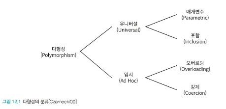
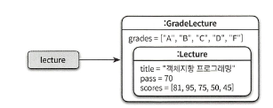
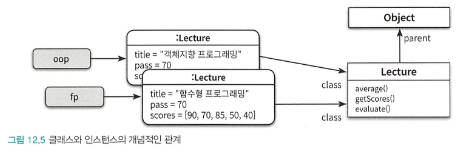
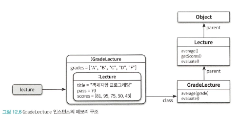
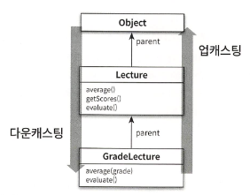

## 다형성
다형성(Polymorphism)이라는 단어는 그리스어에서 '많은'을 의미하는 'poly'와 '형태'를 의미하는 'morph'의 합성어로 '많은 형태를 가질 수 있는 능력'을 의미한다. 컴퓨터 과학에서는 다형성을 하나의 추상 인터페이스에 대해 코드를 작성하고 이 추상 인터페이스에 대해 서로 다른 구현을 연결할 수 있는 능력으로 정의한다[Czmecki00]. 간단하게 말해서 다형성은 여러 타입을 대상으로 동작할 수 있는 코드를 작성할 수 있는 방법이라고 할 수 있다.

객체지향 프로그래밍에서 사용되는 다형성은 그림 12.1과 같이 유니버설(Universal) 다형성과 임시(Ad Hoc) 다형성으로 분류할 수 있다. 유니버설 다형성은 다시 매개변수(Parametric) 다형성과 포함(Inclusion) 다형성으로 분류할 수 있고, 임시 다형성은 오버로딩(Overloading) 다형성과 강제(Coercion) 다형성으로 분류할 수 있다.

강제 다형성은 언어가 지원하는 자동적인 타입 변환이나 사용자가 직접 구현한 타입 변환을 이용해 동일한 연산자를 다양한 타입에 사용할 수 있는 방식을 가리킨다. 예를 들어 자바에서 이항 연산자인 '+'는 피연산자가 모두 정수일 경우에는 정수에 대한 덧셈 연산자로 동작하지만 하나는 정수형이고 다른 하나는 문자열인 경우에는 연결 연산자로 동작한다. 이때 정수형 피연산자는 문자열 타입으로 강제 형변환된다. 일반적으로 오버로딩 다형성과 강제 다형성을 함께 사용하면 모호해질 수 있는데 실제로 어떤 메서드가 호출될지를 판단하기가 어려워지기 때문이다.

매개변수 다형성은 제네릭 프로그래밍과 관련이 높은데 클래스의 인스턴스 변수나 메서드의 매개변수 타입을 임의의 타입으로 선언한 후 사용하는 시점에 구체적인 타입으로 지정하는 방식을 가리킨다. 예를 들어, 자바의 List 인터페이스는 컬렉션에 보관할 요소의 타입을 임의의 타입 T로 지정하고 있으며 실제 인스턴스를 생성하는 시점에 T를 구체적인 타입으로 지정할 수 있게 하고 있다. 따라서 List 인터페이스는 다양한 타입의 요소를 다루기 위해 동일한 오퍼레이션을 사용할 수 있다.

포함 다형성은 메시지가 동일하더라도 수신한 객체의 타입에 따라 실제로 수행되는 행동이 달라지는 능력을 의미한다. 포함 다형성은 서브타입(Subtype) 다형성이라고도 부른다. 포함 다형성은 객체지향 프로그래밍에서 가장 널리 알려진 형태의 다형성이기 때문에 특별한 언급 없이 다형성이라고 할 때는 포함 다형성을 의미하는 것이 일반적이다.

포함 다형성을 구현하는 가장 일반적인 방법은 상속을 사용하는 것이다. 두 클래스를 상속 관계로 연결하고 자식 클래스에서 부모 클래스의 메서드를 오버라이딩한 후 클라이언트는 부모 클래스만 참조하면 포함 다형성을 구현할 수 있다.

포함 다형성을 서브타입 다형성이라고 부른다는 사실에서 예상할 수 있겠지만 포함 다형성을 위한 전제조건은 자식 클래스가 부모 클래스의 서브타입이어야 한다는 것이다. 그리고 상속의 진정한 목적은 코드 재사용이 아니라 다형성을 위한 서브타입 계층을 구축하는 것이다.

이어지는 13장에서는 서브타입을 목적으로 상속을 사용할 때 고려해야 하는 규칙과 원칙에 관해 알아볼 것이다. 그리고 상속 외에도 서브타입 관계를 만들 수 있는 다양한 방법이 존재한다는 사실도 알게 될 것이다. 이번 장에서는 상속의 일차적인 목적이 코드 재사용이 아닌 서브타입의 구현이라는 사실을 이해하는 것만으로도 충분하다.

포함 다형성을 위해 상속을 사용하는 가장 큰 이유는 상속이 클래스들을 계층으로 쌓아 올린 후 상황에 따라 적절한 메서드를 선택할 수 있는 메커니즘을 제공하기 때문이다. 객체가 메시지를 수신하면 객체지향 시스템은 메시지를 처리할 적절한 메서드를 상속 계층 안에서 탐색한다. 실행할 메서드를 선택하는 기준은 어떤 메시지를 수신했는지에 따라, 어떤 클래스의 인스턴스인지에 따라, 상속 계층이 어떻게 구성돼 있는지에 따라 달라진다.

이번 장에서는 다형성의 다양한 측면 중에서 포함 다형성에 관해 중점적으로 다룬다. 오버로딩에 대해서도 약간의 지면을 할애하고는 있지만 대부분의 초점은 포함 다형성의 메커니즘을 설명하는 데 맞출 것이다. 이번 장의 목표는 포함 다형성의 관점에서 런타임에 상속 계층 안에서 적절한 메서드를 선택하는 방법을 이해하는 것이다. 비록 상속 관계를 기준으로 설명을 진행하지만 이번 장에서 다루는 내용은 상속 이외에도 포함 다형성을 구현할 수 있는 다양한 방법에 공통적으로 적용할 수 있는 개념이라는 사실을 기억하기 바란다.

## 상속의 양면성
객체지향 패러다임의 근간을 이루는 아이디어는 데이터와 행동을 객체라고 불리는 하나의 실행 단위 안으로 통합하는 것이다. 따라서 객체지향 프로그램을 작성하기 위해서는 항상 데이터와 행동이라는 두 가지 관점을 함께 고려해야 한다.

상속 역시 예외는 아니다. 상속을 이용하면 부모 클래스에서 정의한 모든 데이터를 자식 클래스의 인스턴스에 자동으로 포함시킬 수 있다. 이것이 데이터 관점의 상속이다. 데이터뿐만 아니라 부모 클래스에서 정의한 일부 메서드 역시 자동으로 자식 클래스에 포함시킬 수 있다. 이것이 행동 관점의 상속이다.

단순히 데이터와 행동의 관점에서만 바라보면 상속이란 부모 클래스에서 정의한 데이터와 행동을 자식 클래스에서 자동적으로 공유할 수 있는 재사용 메커니즘으로 보일 것이다. 하지만 이 관점은 상속을 오해한 것이다.

상속의 목적은 코드 재사용이 아니다. 상속은 프로그램을 구성하는 개념들을 기반으로 다형성을 가능하게 하는 타입 계층을 구축하기 위한 것이다. 타입 계층에 대한 고민 없이 코드를 재사용하기 위해 상속을 사용하면 이해하기 어렵고 유지보수하기 버거운 코드가 만들어질 확률이 높다. 문제를 피할 수 있는 유일한 방법은 상속이 무엇이고 언제 사용해야 하는지를 이해하는 것뿐이다.

이번 장에서는 상속의 메커니즘을 이해하는 데 필요한 몇 가지 개념을 살펴보겠다.
* 업캐스팅
* 동적 메서드 탐색
* 동적 바인딩
* self 참조
* super 참조

이 개념들을 이해하고 나면 상속의 내부 메커니즘뿐만 아니라 타입 계층을 기반으로 한 다형성의 동작 방식을 이해할 수 있게 될 것이다. 상속을 사용하는 간단한 예제 하나를 살펴보는 것으로 시작하자.

### 데이터 관점의 상속

데이터 관점에서 상속은 자식 클래스의 인스턴스 안에 부모 클래스의 인스턴스를 포함하는 것으로 볼 수 있다. 따라서 자식 클래스의 인스턴스는 자동으로 부모 클래스에서 정의한 모든 인스턴스 변수를 내부에 포함하게 되는 것이다.

### 행동 관점의 상속
데이터 관점의 상속이 자식 클래스의 인스턴스 안에 부모 클래스의 인스턴스를 포함하는 개념이라면 행동 관점의 상속은 부모 클래스가 정의한 일부 메서드를 자식 클래스의 메서드로 포함시키는 것을 의미한다.

부모 클래스에 정의된 어떤 메서드가 자식 클래스에 포함될지는 언어의 종류와 각 언어가 정의하는 접근 제어자의 의미에 따라 다르지만 공통적으로 부모 클래스의 모든 퍼블릭 메서드는 자식 클래스의 퍼블릭 인터페이스에 포함된다. 따라서 외부의 객체가 부모 클래스의 인스턴스에게 전송할 수 있는 모든 메시지는 자식 클래스의 인스턴스에게도 전송할 수 있다. 앞에서 부모 클래스인 Lecture 클래스에서 evaluate를 구현하고 있기 때문에 자식 클래스인 GradeLecture에서 evaluate 메서드를 구현하지 않더라도 evaluate 메시지를 처리할 수 있는 이유가 바로 이 때문이다.

부모 클래스의 퍼블릭 인터페이스가 자식 클래스의 퍼블릭 인터페이스에 합쳐진다고 표현했지만 실제로 클래스의 코드를 합치거나 복사하는 작업이 수행되는 것은 아니다. 그렇다면 어떻게 부모 클래스에서 구현한 메서드를 자식 클래스의 인스턴스에서 수행할 수 있는 것일까? 그 이유는 런타임에 시스템이 자식 클래스에 정의되지 않은 메서드가 있을 경우 이 메서드를 부모 클래스 안에서 탐색하기 때문이다.

이처럼 행동 관점에서 상속과 다형성의 기본적인 개념을 이해하기 위해서는 상속 관계로 연결된 클래스 사이의 메서드 탐색 과정을 이해하는 것이 가장 중요하다. 자세한 메서드 탐색 과정은 뒤에서 좀 더 상세히 살펴보기로 하고 여기서는 행동 관점의 상속을 이해하는 데 유용한 객체와 클래스 사이의 관계에 초점을 맞추도록 하자.

객체의 경우에는 서로 다른 상태를 저장할 수 있도록 각 인스턴스별로 독립적인 메모리를 할당받아야 한다. 하지만 메서드의 경우에는 동일한 클래스의 인스턴스끼리 공유가 가능하기 때문에 클래스는 한 번만 메모리에 로드하고 각 인스턴스별로 클래스를 가리키는 포인터를 갖게 하는 것이 경제적이다.

이제 자식 클래스의 인스턴스를 통해 어떻게 부모 클래스에 정의된 메서드를 실행할 수 있는지 살펴보자. 메시지를 수신한 객체는 class 포인터로 연결된 자신의 클래스에서 적절한 메서드가 존재하는지를 찾는다. 만약 메서드가 존재하지 않으면 클래스의 parent 포인터를 따라 부모 클래스를 차례대로 훑어가면서 적절한 메서드가 존재하는지를 검색한다.

자식 클래스에서 부모 클래스로의 메서드 탐색이 가능하기 때문에 자식 클래스는 마치 부모 클래스에 구현된 메서드의 복사본을 가지고 있는 것처럼 보이게 된다. 따라서 각 객체에 포함된 class 포인터와 클래스에 포함된 parent 포인터를 조합하면 현재 인스턴스의 클래스에서 최상위 부모 클래스에 이르기까지 모든 부모 클래스에 접근하는 것이 가능하다.

마지막으로 GradeLecture 클래스의 인스턴스를 생성했을 때의 메모리 구조를 살펴보자. GradeLecture 클래스는 Lecture 클래스의 자식 클래스이기 때문에 그림 12.6에서 볼 수 있는 것처럼 GradeLecture의 인스턴스는 Lecture의 인스턴스를 내부에 포함한다. GradeLecture 인스턴스의 class 포인터를 따라가면 GradeLecture 클래스에 이르고 GradeLecture 클래스의 parent 포인터를 따라가면 부모 클래스인 Lecture 클래스에 이르게 된다. Lecture 클래스의 parent 포인터는 자바에서 모든 클래스의 부모 클래스인 Object를 가리키기 때문에 상속 계층은 여기서 끝나게 된다.

## 업캐스팅과 동적 바인딩
부모 클래스(Lecture) 타입으로 선언된 변수에 자식 클래스(GradeLecture)의 인스턴스를 할당하는 것이 가능하다. 이를 업캐스팅이라고 부른다.

선언된 변수의 타입이 아니라 메시지를 수신하는 객체의 타입에 따라 실행되는 메서드가 결정된다. 이것은 객체지향 시스템이 메시지를 처리할 적절한 메서드를 컴파일 시점이 아니라 실행 시점에 결정하기 때문에 가능하다. 이를 동적 바인딩이라고 부른다.

### 업캐스팅
상속을 이용하면 부모 클래스의 퍼블릭 인터페이스가 자식 클래스의 퍼블릭 인터페이스에 합쳐지기 때문에 부모 클래스의 인스턴스에게 전송할 수 있는 메시지를 자식 클래스의 인스턴스에게 전송할 수 있다. 부모 클래스의 인스턴스 대신 자식 클래스의 인스턴스를 사용하더라도 메시지를 처리하는 데는 아무런 문제가 없으며, 컴파일러는 명시적인 타입 변환 없이도 자식 클래스가 부모 클래스를 대체할 수 있게 허용한다.

이런 특성을 활용할 수 있는 대표적인 두 가지가 대입문과 메서드의 파라미터 타입이다. 모든 객체지향 언어는 명시적으로 타입을 변환하지 않고도 부모 클래스 타입의 참조 변수에 자식 클래스의 인스턴스를 대입할 수 있게 허용한다.

반대로 부모 클래스의 인스턴스를 자식 클래스 타입으로 변환하기 위해서는 명시적인 타입 캐스팅이 필요한데 이를 다운캐스팅(downcasting)이라고 부른다.

컴파일러의 관점에서 자식 클래스는 아무런 제약 없이 부모 클래스를 대체할 수 있기 때문에 부모 클래스와 협력하는 클라이언트는 다양한 자식 클래스의 인스턴스와도 협력하는 것이 가능하다. 여기서 자식 클래스가 현재 상속 계층에 존재하는 자식 클래스뿐만 아니라 앞으로 추가될지도 모르는 미래의 자식 클래스들을 포함한다. Lecture의 모든 자식 클래스는 evaluate 메시지를 이해할 수 있기 때문에 Professor는 Lecture를 상속받는 어떤 자식 클래스와도 협력할 수 있는 무한한 확장 가능성을 가진다. 따라서 이 설계는 유연하며 확장이 용이하다.

### 동적 바인딩
객체지향 언어에서는 메시지를 수신했을 때 실행될 메서드가 런타임에 결정된다. foo.bar()라는 코드를 읽는 것만으로는 실행되는 bar가 어떤 클래스의 어떤 메서드인지를 판단하기 어렵다. foo가 가리키는 객체가 실제로 어떤 클래스의 인스턴스인지를 알아야 하고 bar 메서드가 해당 클래스의 상속 계층의 어디에 위치하는지를 알아야 한다. 이처럼 실행될 메서드를 런타임에 결정하는 방식을 동적 바인딩(dynamic binding) 또는 지연 바인딩(late binding)이라고 부른다.

## 동적 메서드 탐색과 다형성
객체지향 시스템은 다음 규칙에 따라 실행할 메서드를 선택한다.
* 메시지를 수신한 객체는 먼저 자신을 생성한 클래스에 적합한 메서드가 존재하는지 검사한다. 존재하면 메서드를 실행하고 탐색을 종료한다.
* 메서드를 찾지 못했다면 부모 클래스에서 메서드 탐색을 계속한다. 이 과정은 적합한 메서드를 찾을 때까지 상속 계층을 따라 올라가며 계속된다.
* 상속 계층의 가장 최상위 클래스에 이르렀지만 메서드를 발견하지 못한 경우 예외를 발생시키며 탐색을 중단한다.

메시지 탐색과 관련해서 이해해야 하는 중요한 변수가 하나 있다. self 참조(self reference)가 바로 그것이다. 객체가 메시지를 수신하면 컴파일러는 self 참조라는 임시 변수를 자동으로 생성한 후 메시지를 수신한 객체를 가리키도록 설정한다. 동적 메서드 탐색은 self가 가리키는 객체의 클래스에서 시작해서 상속 계층의 역방향으로 이뤄지며 메서드 탐색이 종료되는 순간 self 참조는 자동으로 소멸된다. 시스템은 앞에서 설명한 class 포인터와 parent 포인터와 함께 self 참조를 조합해서 메서드를 탐색한다.

메서드 탐색은 자식 클래스에서 부모 클래스의 방향으로 진행된다. 따라서 항상 자식 클래스의 메서드가 부모 클래스의 메서드보다 먼저 탐색되기 때문에 자식 클래스에 선언된 메서드가 부모 클래스의 메서드보다 더 높은 우선순위를 가지게 된다.

지금까지의 설명을 종합해보면 동적 메서드 탐색은 두 가지 원리로 구성된다는 것을 알 수 있다. 첫 번째 원리는 자동적인 메시지 위임이다. 자식 클래스는 자신이 이해할 수 없는 메시지를 전송받은 경우 상속 계층을 따라 부모 클래스에게 처리를 위임한다. 클래스 사이의 위임은 프로그래머의 개입 없이 상속 계층을 따라 자동으로 이뤄진다.

두 번째 원리는 메서드를 탐색하기 위해 동적인 문맥을 사용한다는 것이다. 메시지를 수신했을 때 실제로 어떤 메서드를 실행할지를 결정하는 것은 컴파일 시점이 아닌 실행 시점에 이뤄지며, 메서드를 탐색하는 경로는 self 참조를 이용해서 결정한다.

### 자동적인 메시지 위임
동적 메서드 탐색의 입장에서 상속 계층은 메시지를 수신한 객체가 자신이 이해할 수 없는 메시지를 부모 클래스에게 전달하기 위한 물리적인 경로를 정의하는 것으로 볼 수 있다. 상속 계층 안의 클래스는 메시지를 처리할 방법을 알지 못할 경우 메시지에 대한 처리를 부모 클래스에게 위임한다. 메시지 처리를 위임받은 부모 클래스 역시 수신한 메시지를 이해할 수 없다면 자신의 부모 클래스에게 메시지를 전달한다. 여기서 핵심은 적절한 메서드를 찾을 때까지 상속 계층을 따라 부모 클래스로 처리가 위임된다는 것이다.

상속을 이용할 경우 프로그래머가 메시지 위임과 관련된 코드를 명시적으로 작성할 필요가 없음에 주목하라. 메시지는 상속 계층을 따라 부모 클래스에게 자동으로 위임된다[Metz12]. 이런 관점에서 상속 계층을 정의하는 것은 메서드 탐색 경로를 정의하는 것과 동일하다.

자식 클래스에서 부모 클래스의 방향으로 자동으로 메시지 처리가 위임되기 때문에 자식 클래스에서 어떤 메서드를 구현하고 있느냐에 따라 부모 클래스에 구현된 메서드의 운명이 결정되기도 한다. 메서드 오버라이딩은 자식 클래스의 메서드가 동일한 시그니처를 가진 부모 클래스의 메서드보다 먼저 탐색되기 때문에 벌어지는 현상이다.

동일한 시그니처를 가지는 자식 클래스의 메서드는 부모 클래스의 메서드를 감추지만 이름만 같고 시그니처가 완전히 동일하지 않은 메서드들은 상속 계층에 걸쳐 사이좋게 공존할 수도 있다. 이것이 바로 메서드 오버로딩이다. 뒤에서 살펴보겠지만 메서드 오버라이딩은 모든 객체지향 언어에서 유사하게 동작하는 데 비해 메서드 오버로딩은 언어에 따라 조금씩 달라질 수 있다.

대부분의 사람들은 하나의 클래스 안에서 같은 이름을 가진 메서드들을 정의하는 것은 메서드 오버로딩으로 생각하고 상속 계층 사이에서 같은 이름을 가진 메서드를 정의하는 것은 메서드 오버로딩으로 생각하지 않는 경향이 있다.

self 전송은 self 참조부터 탐색을 다시 시작하게 만든다.

### 이해할 수 없는 메시지
정적 타입 언어와 이해할 수 없는 메시지

정적 타입 언어에서는 코드를 컴파일할 때 상속 계층 안의 클래스들이 메시지를 이해할 수 있는지 여부를 판단한다. 따라서 상속 계층 전체를 탐색한 후에도 메시지를 처리할 수 있는 메서드를 발견하지 못했다면 컴파일 에러를 발생시킨다.

동적 타입 언어와 이해할 수 없는 메시지

동적 타입 언어 역시 메시지를 수신한 객체의 클래스부터 부모 클래스의 방향으로 메서드를 탐색한다. 차이점이라면 동적 타입 언어에는 컴파일 단계가 존재하지 않기 때문에 실제로 코드를 실행해보기 전에는 메시지 처리 가능 여부를 판단할 수 없다는 점이다.

몇 가지 동적 타입 언어는 최상위 클래스까지 메서드를 탐색한 후에 메서드를 처리할 수 없다는 사실을 발견하면 self 참조가 가리키는 현재 객체에게 메시지를 이해할 수 없다는 메시지를 전송한다.

### self 대 super
self 참조의 가장 큰 특징은 동적이라는 점이다. self 참조는 메시지를 수신한 객체의 클래스에 따라 메서드 탐색을 위한 문맥을 실행 시점에 결정한다. self의 이런 특성과 대비해서 언급할 만한 가치가 있는 것이 바로 super 참조(super reference)다.

자식 클래스에서 부모 클래스의 구현을 재사용해야 하는 경우가 있다. 대부분의 객체지향 언어들은 자식 클래스에서 부모 클래스의 인스턴스 변수나 메서드에 접근하기 위해 사용할 수 있는 super 참조라는 내부 변수를 제공한다.

대부분의 사람들은 super.evaluate()라는 문장이 단순히 부모 클래스의 evaluate 메서드를 호출한다고 생각할 것이다. 하지만 super.evaluate()에 의해 호출되는 메서드는 부모 클래스의 메서드가 아니라 더 상위에 위치한 조상 클래스의 메서드일 수도 있다.

사실 super 참조의 용도는 부모 클래스에 정의된 메서드를 실행하기 위한 것이 아니다. super 참조의 정확한 의도는 '지금 이 클래스의 부모 클래스에서부터 메서드 탐색을 시작하세요'다. 만약 부모 클래스에서 원하는 메서드를 찾지 못한다면 더 상위의 부모 클래스로 이동하면서 메서드가 존재하는지 검사한다.

이것은 super 참조를 통해 실행하고자 하는 메서드가 반드시 부모 클래스에 위치하지 않아도 되는 유연성을 제공한다. 그 메서드가 조상 클래스 어딘가에 있기만 하면 성공적으로 탐색될 것이기 때문이다.

부모 클래스의 메서드를 호출하는 것과 부모 클래스에서 메서드 탐색을 시작하는 것은 의미가 매우 다르다. 부모 클래스의 메서드를 호출한다는 것은 그 메서드가 반드시 부모 클래스 안에 정의돼 있어야 한다는 것을 의미한다. 그에 비해 부모 클래스에서 메서드 탐색을 시작한다는 것은 그 클래스의 조상 어딘가에 그 메서드가 정의돼 있기만 하면 실행할 수 있다는 것을 의미한다.

이처럼 super 참조를 통해 메시지를 전송하는 것은 마치 부모 클래스의 인스턴스에게 메시지를 전송하는 것처럼 보이기 때문에 이를 super 전송(super send)이라고 부른다.

self 전송이 메시지를 수신하는 객체의 클래스에 따라 메서드를 탐색할 시작 위치를 동적으로 결정하는 데 비해 super 전송은 항상 메시지를 전송하는 클래스의 부모 클래스에서부터 시작된다.

super 전송은 항상 해당 클래스의 부모 클래스에서부터 메서드 탐색을 시작한다. self 전송에서 메시지 탐색을 시작하는 클래스는 미정이지만 super 전송에서는 미리 정해진다는 것이다. 따라서 self 전송의 경우 메서드 탐색을 시작할 클래스를 반드시 실행 시점에 동적으로 결정해야 하지만 super 전송의 경우에는 컴파일 시점에 미리 결정해 놓을 수 있다.

## 상속 대 위임
### 위임과 self 참조
메서드 탐색 중에는 자식 클래스의 인스턴스와 부모 클래스의 인스턴스가 동일한 self 참조를 공유하는 것으로 봐도 무방하다. 앞의 그림 12.4에서 포함관계로 표현된 인스턴스들을 인스턴스 사이의 링크를 가진 연결관계로 표현할 수 있다고 했던 것을 기억하라.

자신이 수신한 메시지를 다른 객체에게 동일하게 전달해서 처리를 요청하는 것을 위임(delegation)이라고 부른다.

위임은 항상 현재의 실행 문맥을 가리키는 self 참조를 인자로 전달한다. 이것이 포워딩과 위임의 차이점이다.

객체가 다른 객체에게 요청을 처리할 때 인자로 self를 전달하지 않을 수도 있다. 이것은 요청을 전달받은 최초의 객체에게 다시 메시지를 전송할 필요는 없고 단순히 코드를 재사용하고 싶은 경우라고 할 수 있다. 이처럼 처리를 요청할 때 self 참조를 전달하지 않는 경우를 포워딩이라고 부른다. 이와 달리 self 참조를 전달하는 경우에는 위임이라고 부른다.

위임의 정확한 용도는 클래스를 이용한 상속 관계를 객체 사이의 합성 관계로 대체해서 다형성을 구현하는 것이다.